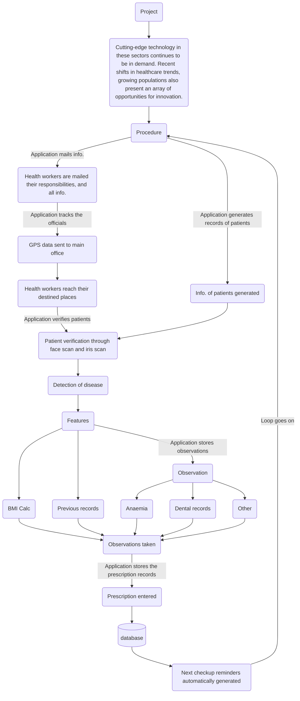
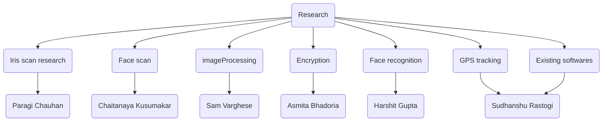

# SIH
Project for Smart India Hackathon

## Project Flowchart

```mermaid
flowchart TD;
model(Project)-->prob(Cutting-edge technology in these sectors continues to be in demand. Recent shifts in healthcare trends, growing populations also present an array of opportunities for innovation.)
prob --> proc(Procedure)
proc-->|Application mails info.|aang(Health workers are mailed their responsibilities, and all info.)
proc-->|Application generates records of patients|info(Info. of patients generated)
aang-->|Application tracks the officials|gps(GPS data sent to main office)
gps-->reached(Health workers reach their destined places)
reached-->|Application verifies patients|biometric(Patient verification through face scan and iris scan)
info-->biometric
biometric-->treatment(Detection of disease)
treatment-->Feat(Features)
Feat-->BMI(BMI Calc)
Feat-->Prevrecord(Previous records)
Feat-->|Application stores observations|obs(Observation)
obs-->anem(Anaemia)
obs-->dental(Dental records)
obs-->other(Other)
BMI-->obsTaken(Observations taken)
Prevrecord-->obsTaken
anem-->obsTaken
dental-->obsTaken
other-->obsTaken
obsTaken-->|Application stores the prescription records|presc(Prescription entered)
presc-->database[(database)]
database-->reminder(Next checkup reminders automatically generated)
reminder-->|Loop goes on|proc
```

## Task distribution

```mermaid
graph TD;
research(Research)-->IrisScanResearch(Iris scan research)
research-->faceScan(Face scan)
research-->imageProcessing(imageProcessing)
research-->encrypt(Encryption)
research-->FaceRecog(Face recognition)
research-->gps(GPS tracking)
research-->existing(Existing softwares)
IrisScanResearch-->paragi(Paragi Chauhan)
encrypt-->asmita(Asmita Bhadoria)
gps-->sudhanshu(Sudhanshu Rastogi)
imageProcessing-->sam(Sam Varghese)
FaceRecog-->harshit(Harshit Gupta)
faceScan-->chait(Chaitanaya Kusumakar)
existing-->sudhanshu
```
